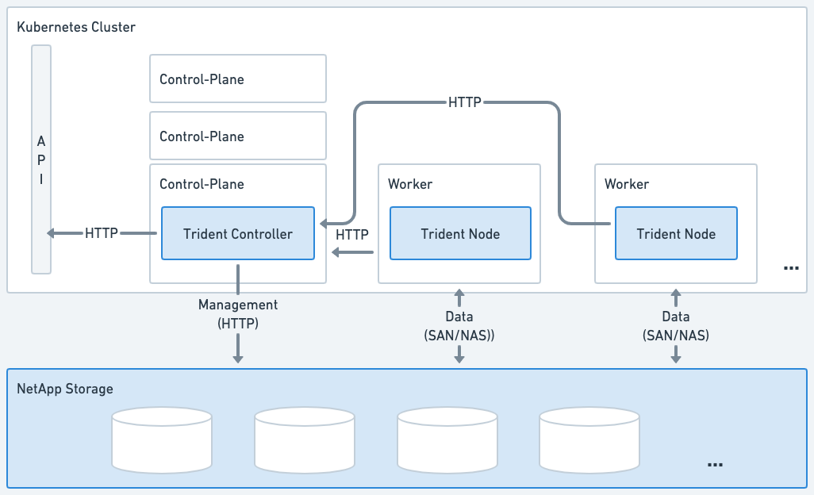
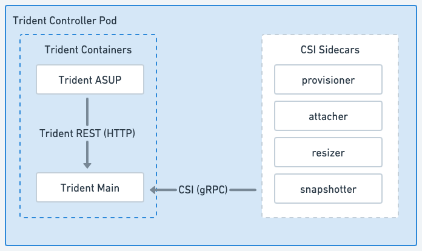
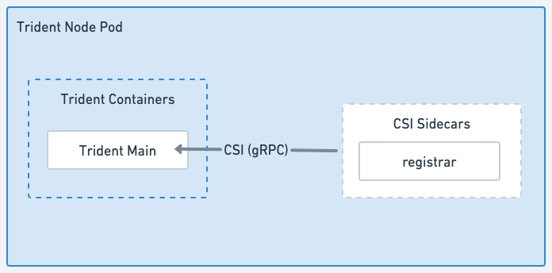

= Astra Tridentのアーキテクチャ
:hardbreaks:
:allow-uri-read: 
:icons: font
:imagesdir: ../media/

[role="lead"]
Astra Tridentは、単一のコントローラポッドと、クラスタ内の各ワーカーノード上のノードポッドとして実行されます。Astra Tridentボリュームをマウントするすべてのホストでノードポッドが実行されている必要があります。

== コントローラポッドとノードポッドについて

Astra Tridentを単一システムとして導入 <<Tridentコントローラポッド>> および1つ以上 <<Tridentノードポッド>> Kubernetesクラスタ上で、標準のKUBSI_CSI Sidecar Containers_を使用してCSIプラグインの導入を簡素化します。 link:https://kubernetes-csi.github.io/docs/sidecar-containers.html["Kubernetes CSIサイドカーコンテナ"^] Kubernetes Storageコミュニティが管理しています。

Kubernetes link:https://kubernetes.io/docs/concepts/scheduling-eviction/assign-pod-node/["ノードセレクタ"^] および link:https://kubernetes.io/docs/concepts/scheduling-eviction/taint-and-toleration/["寛容さと汚れ"^] は、特定のノードまたは優先ノードで実行されるようにポッドを制限するために使用されます。コントローラポッドとノードポッドのノードセレクタと許容範囲は、Astra Tridentのインストール時に設定できます。

* コントローラプラグインは、Snapshotやサイズ変更などのボリュームのプロビジョニングと管理を処理します。
* ノードプラグインによって、ノードへのストレージの接続が処理されます。

.Kubernetesクラスタに導入されるAstra Trident

=== Tridentコントローラポッド

Tridentコントローラポッドは、CSIコントローラプラグインを実行する単一のポッドです。

* NetAppストレージ内のボリュームのプロビジョニングと管理を担当
* Kubernetes環境で管理
* インストールパラメータに応じて、コントロールプレーンノードまたはワーカーノードで実行できます。

.Tridentコントローラポッドの図

=== Tridentノードポッド

Tridentノードポッドは、CSIノードプラグインを実行する特権ポッドです。

* ホストで実行されているPodのストレージのマウントとアンマウントを担当します。
* Kubernetesデーモンセットで管理
* NetAppストレージをマウントするすべてのノードで実行する必要がある

.Tridentノードのポッド図

== サポートされる Kubernetes クラスタアーキテクチャ

Astra Trident は、次の Kubernetes アーキテクチャでサポートされています。

[cols="3,1,2"]
|===
| Kubernetes クラスタアーキテクチャ | サポートされます | デフォルトのインストールです 

| 単一マスター、コンピューティング | はい。  a| 
はい。

| 複数のマスター、コンピューティング | はい。  a| 
はい。

| マスター、「 etcd' 」、コンピューティング | はい。  a| 
はい。

| マスター、インフラ、コンピューティング | はい。  a| 
はい。

|===