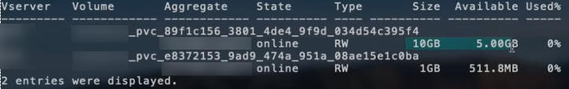

= 設定オプションと例
:hardbreaks:
:allow-uri-read: 
:icons: font
:imagesdir: ../media/

ONTAP NAS ドライバを作成して Astra Trident インストールで使用する方法をご確認ください。このセクションでは、バックエンド構成の例と、バックエンドをストレージクラスにマッピングする方法を詳しく説明します。

== バックエンド構成オプション

バックエンド設定オプションについては、次の表を参照してください。

[cols="3"]
|===
| パラメータ | 説明 | デフォルト 

| 「バージョン」 |  | 常に 1 

| 'torageDriverName' | ストレージドライバの名前 | 「 ONTAP-NAS 」、「 ONTAP-NAS-エコノミー 」、「 ONTAP-NAS-flexgroup 」、「 ONTAP-SAN 」、「 ONTAP-SAN-エコノミー 」 

| backendName` | カスタム名またはストレージバックエンド | ドライバ名 + "_" + データ LIF 

| 「管理 LIF 」 | クラスタ管理 LIF または SVM 管理 LIF の IP アドレス | 「 10.0.0.1 」、「 [2001:1234:abcd::fefe] 」 

| 「重複排除 | プロトコル LIF の IP アドレス。IPv6 には角かっこを使用します。設定後に更新することはできません | 特に指定がないかぎり、 SVM が派生します 

| 「 autoExportPolicy 」を参照してください | エクスポートポリシーの自動作成と更新を有効にする [ ブーリアン ] | いいえ 

| 「 autoExportCI` 」 | 「 autoExportPolicy 」が有効な場合に、 Kubernetes のノード IP をフィルタリングするための CIDR のリスト | [0.0.0.0/0] 、 [::/0] 

| 「ラベル」 | ボリュームに適用する任意の JSON 形式のラベルのセット | 「」 

| 「 clientCertificate 」をクリックします | クライアント証明書の Base64 エンコード値。証明書ベースの認証に使用されます | 「」 

| 「 clientPrivateKey 」 | クライアント秘密鍵の Base64 エンコード値。証明書ベースの認証に使用されます | 「」 

| 「 trustedCacertifate 」 | 信頼された CA 証明書の Base64 エンコード値。任意。証明書ベースの認証に使用されます | 「」 

| 「ユーザ名」 | クラスタ / SVM に接続するためのユーザ名。クレデンシャルベースの認証に使用されます |  

| 「 password 」と入力します | クラスタ / SVM に接続するためのパスワード。クレデンシャルベースの認証に使用されます |  

| 'VM' | 使用する Storage Virtual Machine | SVM 「管理 LIF 」が指定されている場合に生成されます 

| 「 igroupName 」と入力します | SAN ボリュームで使用する igroup の名前 | "trident-<backend-UUID> " 

| 'toragePrefix' | SVM で新しいボリュームをプロビジョニングする際に使用するプレフィックスを指定します。設定後に更新することはできません | Trident 

| 「 AggreglimitateUsage 」と入力します | 使用率がこの割合を超えている場合は、プロビジョニングが失敗します。* Amazon FSX for ONTAP * には適用されません | “”（デフォルトでは適用されません） 

| 「 limitVolumeSize 」と入力します | 要求されたボリュームサイズがエコノミードライバーのこの値を超えている場合、プロビジョニングは失敗します。 | “”（デフォルトでは適用されません） 

| 'lunsPerFlexvol | FlexVol あたりの最大 LUN 数。有効な範囲は 50 、 200 です | 100 

| 「バグトレースフラグ」 | トラブルシューティング時に使用するデバッグフラグ。例： {"API" ： false 、 "method" ： true} | null 

| 「 nfsvMountOptions 」のように入力します | NFS マウントオプションをカンマで区切ったリスト | 「」 

| qtreesPerFlexvol` | FlexVol あたりの最大 qtree 数。有効な範囲は [50 、 300] です。 | 200 

| 「 useREST` 」 | ONTAP REST API を使用するためのブーリアンパラメータ。* テクニカルプレビュー * | いいえ 
|===

NOTE: 「 useREST 」は **tech preview** として提供されています。これはテスト環境では推奨され、本番ワークロードでは推奨されません。「 true 」に設定すると、 Astra Trident は ONTAP REST API を使用してバックエンドと通信します。この機能を使用するには、 ONTAP 9.9 以降が必要です。また ' 使用する ONTAP ログイン・ロールには ONTAP アプリケーションへのアクセス権が必要ですこれは ' 事前に定義された vsadmin ロールと cluster-admin ロールによって満たされます

ONTAP クラスタと通信するには、認証パラメータを指定する必要があります。これは、セキュリティログインまたはインストールされている証明書のユーザ名 / パスワードです。

WARNING: NetApp ONTAP バックエンドに Amazon FSX を使用している場合は、「 limitAggregateUsage 」パラメータを指定しないでください。Amazon FSX for NetApp ONTAP が提供する「 fsxadmin 」と「 vsadmin 」の役割には、集計の使用状況を取得したり、 Astra Trident を介して制限したりするために必要なアクセス権限が含まれていません。

WARNING: トラブルシューティングを行い、詳細なログダンプが必要な場合を除き、「 ebugTraceFlags 」は使用しないでください。

NOTE: バックエンドを作成するときは、作成後に「 dataLIF' 」と「 toragePrefix 」を変更できないことに注意してください。これらのパラメータを更新するには、新しいバックエンドを作成する必要があります。

「管理 LIF 」オプションには完全修飾ドメイン名（ FQDN ）を指定できます。「 atalif 」オプションに FQDN を指定した場合も、 NFS のマウント処理に FQDN が使用されます。こうすることで、ラウンドロビン DNS を作成して、複数のデータ LIF 間で負荷を分散することができます。

すべての ONTAP ドライバ用の「管理 LIF 」を IPv6 アドレスに設定することもできます。Astra Trident には '--use-ipv6' フラグを付けてインストールしてください角かっこで囲まれた「管理 LIF 」 IPv6 アドレスを定義するように注意する必要があります。

WARNING: IPv6 アドレスを使用する場合は、 [28e8:d9fb:a825:b7bf:69a8:d02f:9e7b:3555] のように、バックエンド定義に含まれている場合は「 anagementlif` 」と「 datalif 」が角かっこ内に定義されていることを確認してください。「 data lif 」を指定しない場合、 Astra Trident は SVM から IPv6 データ LIF を取得します。

CSI Trident では、「 autoExportPolicy 」オプションおよび「 autoExportCIDRs 」オプションを使用して、エクスポートポリシーを自動的に管理できます。これはすべての ONTAP-NAS-* ドライバでサポートされています。

「 ONTAP-NAS-エコノミー 」ドライバの場合、「 limitVolumeSize 」オプションを使用すると、 qtree および LUN 用に管理するボリュームの最大サイズも制限されます。「 qtreesPerFlexvol 」オプションを使用すると、 FlexVol あたりの最大 qtree 数をカスタマイズできます。

マウントオプションを指定するには 'nfsMountOptions' パラメータを使用しますKubernetes 永続ボリュームのマウントオプションは通常ストレージクラスで指定されますが、ストレージクラスでマウントオプションが指定されていない場合、 Astra Trident はストレージバックエンドの構成ファイルで指定されているマウントオプションを使用します。ストレージクラスまたは構成ファイルにマウントオプションが指定されていない場合、 Astra Trident は関連付けられた永続的ボリュームにマウントオプションを設定しません。

NOTE: Astra Trident は 'ONTAP-NAS' および 'ONTAP-NAS-flexgroup を使用して作成されたすべてのボリュームの Comments フィールドにプロビジョニングラベルを設定します使用するドライバに基づいて ' コメントは FlexVol (`ONTAP-NAS') または FlexGroup (`ONTAP-NAS-flexgroup ') に設定されますTrident が、ストレージプール上にあるすべてのラベルを、プロビジョニング時にストレージボリュームにコピーします。ストレージ管理者は、ストレージプールごとにラベルを定義し、ストレージプール内に作成されたすべてのボリュームをグループ化できます。これにより、バックエンド構成で提供されるカスタマイズ可能な一連のラベルに基づいてボリュームを簡単に区別できます。

=== ボリュームのプロビジョニング用のバックエンド構成オプション

これらのオプションを使用して、構成の特別なセクションで各ボリュームをデフォルトでプロビジョニングする方法を制御できます。例については、以下の設定例を参照してください。

[cols="3"]
|===
| パラメータ | 説明 | デフォルト 

| 「平和の配分」 | space-allocation for LUN のコマンドを指定します | 正しいです 

| 「平和のための準備」を参照してください | スペースリザベーションモード：「 none 」（シン）または「 volume 」（シック） | なし 

| 「ナプショットポリシー」 | 使用する Snapshot ポリシー | なし 

| 「 QOSPolicy 」 | 作成したボリュームに割り当てる QoS ポリシーグループ。ストレージプール / バックエンドごとに QOSPolicy または adaptiveQosPolicy のいずれかを選択します | 「」 

| 「 adaptiveQosPolicy 」を参照してください | アダプティブ QoS ポリシーグループ：作成したボリュームに割り当てます。ストレージプール / バックエンドごとに QOSPolicy または adaptiveQosPolicy のいずれかを選択します。経済性に影響する ONTAP - NAS ではサポートされません。 | 「」 

| 「スナップショット予約」 | スナップショット "0" 用に予約されたボリュームの割合 | 「 napshotPolicy 」が「 none 」の場合、それ以外の場合は「」 

| 'plitOnClone | 作成時にクローンを親からスプリットします | いいえ 

| 「暗号化」 | ネットアップのボリューム暗号化を有効にします | いいえ 

| 'ecurityStyle' | 新しいボリュームのセキュリティ形式 | 「 UNIX 」 

| 階層ポリシー | 「なし」を使用する階層化ポリシー | ONTAP 9.5 よりも前の SVM-DR 構成の「スナップショットのみ」 

| unixPermissions | 新しいボリュームのモード | 777 

| Snapshot ディレクトリ | 「 .snapshot 」ディレクトリの表示を制御します | いいえ 

| エクスポートポリシー | 使用するエクスポートポリシー | デフォルト 

| securityStyle の追加 | 新しいボリュームのセキュリティ形式 | 「 UNIX 」 
|===

NOTE: Trident が Astra で QoS ポリシーグループを使用するには、 ONTAP 9.8 以降が必要です。共有されない QoS ポリシーグループを使用して、各コンスティチュエントに個別にポリシーグループを適用することを推奨します。共有 QoS ポリシーグループにより、すべてのワークロードの合計スループットに対して上限が適用されます。

次に、デフォルトが定義されている例を示します。

[listing]
----
{
  "version": 1,
  "storageDriverName": "ontap-nas",
  "backendName": "customBackendName",
  "managementLIF": "10.0.0.1",
  "dataLIF": "10.0.0.2",
  "labels": {"k8scluster": "dev1", "backend": "dev1-nasbackend"},
  "svm": "trident_svm",
  "username": "cluster-admin",
  "password": "password",
  "limitAggregateUsage": "80%",
  "limitVolumeSize": "50Gi",
  "nfsMountOptions": "nfsvers=4",
  "debugTraceFlags": {"api":false, "method":true},
  "defaults": {
    "spaceReserve": "volume",
    "qosPolicy": "premium",
    "exportPolicy": "myk8scluster",
    "snapshotPolicy": "default",
    "snapshotReserve": "10"
  }
}
----
「 ONTAP-NAS' 」と「 ONTAP-NAS-flexgroups' では、 Astra Trident は新しい計算を使用して、 FlexVol がスナップショット予約の割合と PVC で正しくサイズ設定されるようにします。ユーザが PVC を要求すると、 Astra Trident は、新しい計算を使用して、より多くのスペースを持つ元の FlexVol を作成します。この計算により、ユーザは要求された PVC 内の書き込み可能なスペースを受信し、要求されたスペースよりも少ないスペースを確保できます。v21.07 より前のバージョンでは、ユーザが PVC を要求すると（ 5GiB など）、 snapshotReserve が 50% に設定されている場合、書き込み可能なスペースは 2.5GiB のみになります。これは、ユーザが要求したボリューム全体が「 SnapshotReserve 」であるためです。Trident 21.07 では、ユーザが要求するのは書き込み可能なスペースであり、 Astra Trident は「 napshotReserve 」の値をボリューム全体の割合で定義します。これは「 ONTAP-NAS-エコノミー 」には適用されません。この機能の仕組みについては、次の例を参照してください。

計算は次のとおりです。

[listing]
----
Total volume size = (PVC requested size) / (1 - (snapshotReserve percentage) / 100)
----
snapshotReserve = 50% 、 PVC 要求 = 5GiB の場合、ボリュームの合計サイズは 2/0.5 = 10GiB であり、使用可能なサイズは 5GiB であり、これが PVC 要求で要求されたサイズです。volume show コマンドは ' 次の例のような結果を表示する必要があります

以前のインストールからの既存のバックエンドは、 Astra Trident のアップグレード時に前述のようにボリュームをプロビジョニングします。アップグレード前に作成したボリュームについては、変更が反映されるようにボリュームのサイズを変更する必要があります。たとえば、「 napshotReserve 」が 50 であった 2GiB PVC の場合、ボリュームは書き込み可能なスペースが 1GiB であると考えられていました。たとえば、ボリュームのサイズを 3GiB に変更すると、アプリケーションの書き込み可能なスペースが 6GiB のボリュームで 3GiB になります。

== 最小限の設定例

次の例は、ほとんどのパラメータをデフォルトのままにする基本的な設定を示しています。これは、バックエンドを定義する最も簡単な方法です。

NOTE: ネットアップ ONTAP で Trident を使用している場合は、 IP アドレスではなく LIF の DNS 名を指定することを推奨します。

=== 証明書ベースの認証を使用する ONTAP - NAS ドライバ

これは、バックエンドの最小限の設定例です。「 clientCertificate` 」、「 clientPrivateKey 」、「 trustedCACertifate` （信頼された CA を使用する場合はオプション）」は「 backend.json 」に格納され、それぞれクライアント証明書、秘密鍵、信頼された CA 証明書の Base64 でエンコードされた値を取得します。

[listing]
----
{
  "version": 1,
  "backendName": "DefaultNASBackend",
  "storageDriverName": "ontap-nas",
  "managementLIF": "10.0.0.1",
  "dataLIF": "10.0.0.15",
  "svm": "nfs_svm",
  "clientCertificate": "ZXR0ZXJwYXB...ICMgJ3BhcGVyc2",
  "clientPrivateKey": "vciwKIyAgZG...0cnksIGRlc2NyaX",
  "trustedCACertificate": "zcyBbaG...b3Igb3duIGNsYXNz",
  "storagePrefix": "myPrefix_"
}
----

=== ONTAP - NAS ドライバと auto エクスポートポリシーが設定されています

この例は、動的なエクスポートポリシーを使用してエクスポートポリシーを自動的に作成および管理するように Astra Trident に指示する方法を示しています。これは「 ONTAP-NAS-エコノミー 」と「 ONTAP-NAS-flexgroup 」ドライバで同様に機能します。

[listing]
----
{
    "version": 1,
    "storageDriverName": "ontap-nas",
    "managementLIF": "10.0.0.1",
    "dataLIF": "10.0.0.2",
    "svm": "svm_nfs",
    "labels": {"k8scluster": "test-cluster-east-1a", "backend": "test1-nasbackend"},
    "autoExportPolicy": true,
    "autoExportCIDRs": ["10.0.0.0/24"],
    "username": "admin",
    "password": "secret",
    "nfsMountOptions": "nfsvers=4",
}
----

=== ONTAP-NAS-flexgroup ドライバ

[listing]
----
{
    "version": 1,
    "storageDriverName": "ontap-nas-flexgroup",
    "managementLIF": "10.0.0.1",
    "dataLIF": "10.0.0.2",
    "labels": {"k8scluster": "test-cluster-east-1b", "backend": "test1-ontap-cluster"},
    "svm": "svm_nfs",
    "username": "vsadmin",
    "password": "secret",
}
----

=== IPv6 を使用した ONTAP - NAS ドライバ

[listing]
----
{
 "version": 1,
 "storageDriverName": "ontap-nas",
 "backendName": "nas_ipv6_backend",
 "managementLIF": "[5c5d:5edf:8f:7657:bef8:109b:1b41:d491]",
 "labels": {"k8scluster": "test-cluster-east-1a", "backend": "test1-ontap-ipv6"},
 "svm": "nas_ipv6_svm",
 "username": "vsadmin",
 "password": "netapp123"
}
----

=== ONTAP - NAS - エコノミードライバ

[listing]
----
{
    "version": 1,
    "storageDriverName": "ontap-nas-economy",
    "managementLIF": "10.0.0.1",
    "dataLIF": "10.0.0.2",
    "svm": "svm_nfs",
    "username": "vsadmin",
    "password": "secret"
}
----

== 仮想ストレージプールを使用するバックエンドの例

以下に示すバックエンド定義ファイルの例では ' すべてのストレージ・プールに対して特定のデフォルトが設定されていますたとえば 'paceReserve at none'`paceAllocation] at false' と 'encryption' は false です仮想ストレージプールは、ストレージセクションで定義します。

この例では ' 一部のストレージ・プールで独自の 'aceReserve'`paceAllocation] ' および [encryption`] 値が設定されていますまた ' 一部のプールでは ' 上で設定したデフォルト値が上書きされます

=== ONTAP - NAS ドライバ

[listing]
----
{
    {
    "version": 1,
    "storageDriverName": "ontap-nas",
    "managementLIF": "10.0.0.1",
    "dataLIF": "10.0.0.2",
    "svm": "svm_nfs",
    "username": "admin",
    "password": "secret",
    "nfsMountOptions": "nfsvers=4",

    "defaults": {
          "spaceReserve": "none",
          "encryption": "false",
          "qosPolicy": "standard"
    },
    "labels":{"store":"nas_store", "k8scluster": "prod-cluster-1"},
    "region": "us_east_1",
    "storage": [
        {
            "labels":{"app":"msoffice", "cost":"100"},
            "zone":"us_east_1a",
            "defaults": {
                "spaceReserve": "volume",
                "encryption": "true",
                "unixPermissions": "0755",
                "adaptiveQosPolicy": "adaptive-premium"
            }
        },
        {
            "labels":{"app":"slack", "cost":"75"},
            "zone":"us_east_1b",
            "defaults": {
                "spaceReserve": "none",
                "encryption": "true",
                "unixPermissions": "0755"
            }
        },
        {
            "labels":{"app":"wordpress", "cost":"50"},
            "zone":"us_east_1c",
            "defaults": {
                "spaceReserve": "none",
                "encryption": "true",
                "unixPermissions": "0775"
            }
        },
        {
            "labels":{"app":"mysqldb", "cost":"25"},
            "zone":"us_east_1d",
            "defaults": {
                "spaceReserve": "volume",
                "encryption": "false",
                "unixPermissions": "0775"
            }
        }
    ]
}
----

=== ONTAP-NAS-flexgroup ドライバ

[listing]
----
{
    "version": 1,
    "storageDriverName": "ontap-nas-flexgroup",
    "managementLIF": "10.0.0.1",
    "dataLIF": "10.0.0.2",
    "svm": "svm_nfs",
    "username": "vsadmin",
    "password": "secret",

    "defaults": {
          "spaceReserve": "none",
          "encryption": "false"
    },
    "labels":{"store":"flexgroup_store", "k8scluster": "prod-cluster-1"},
    "region": "us_east_1",
    "storage": [
        {
            "labels":{"protection":"gold", "creditpoints":"50000"},
            "zone":"us_east_1a",
            "defaults": {
                "spaceReserve": "volume",
                "encryption": "true",
                "unixPermissions": "0755"
            }
        },
        {
            "labels":{"protection":"gold", "creditpoints":"30000"},
            "zone":"us_east_1b",
            "defaults": {
                "spaceReserve": "none",
                "encryption": "true",
                "unixPermissions": "0755"
            }
        },
        {
            "labels":{"protection":"silver", "creditpoints":"20000"},
            "zone":"us_east_1c",
            "defaults": {
                "spaceReserve": "none",
                "encryption": "true",
                "unixPermissions": "0775"
            }
        },
        {
            "labels":{"protection":"bronze", "creditpoints":"10000"},
            "zone":"us_east_1d",
            "defaults": {
                "spaceReserve": "volume",
                "encryption": "false",
                "unixPermissions": "0775"
            }
        }
    ]
}
----

=== ONTAP - NAS - エコノミードライバ

[listing]
----
{
    "version": 1,
    "storageDriverName": "ontap-nas-economy",
    "managementLIF": "10.0.0.1",
    "dataLIF": "10.0.0.2",
    "svm": "svm_nfs",
    "username": "vsadmin",
    "password": "secret",

    "defaults": {
          "spaceReserve": "none",
          "encryption": "false"
    },
    "labels":{"store":"nas_economy_store"},
    "region": "us_east_1",
    "storage": [
        {
            "labels":{"department":"finance", "creditpoints":"6000"},
            "zone":"us_east_1a",
            "defaults": {
                "spaceReserve": "volume",
                "encryption": "true",
                "unixPermissions": "0755"
            }
        },
        {
            "labels":{"department":"legal", "creditpoints":"5000"},
            "zone":"us_east_1b",
            "defaults": {
                "spaceReserve": "none",
                "encryption": "true",
                "unixPermissions": "0755"
            }
        },
        {
            "labels":{"department":"engineering", "creditpoints":"3000"},
            "zone":"us_east_1c",
            "defaults": {
                "spaceReserve": "none",
                "encryption": "true",
                "unixPermissions": "0775"
            }
        },
        {
            "labels":{"department":"humanresource", "creditpoints":"2000"},
            "zone":"us_east_1d",
            "defaults": {
                "spaceReserve": "volume",
                "encryption": "false",
                "unixPermissions": "0775"
            }
        }
    ]
}
----

== バックエンドを StorageClasses にマッピングします

次の StorageClass 定義は、上記の仮想ストレージプールを参照してください。parameters.selector` フィールドを使用すると ' 各 StorageClass は ' ボリュームのホストに使用できる仮想プールを呼び出しますボリュームには、選択した仮想プール内で定義された要素があります。

* 最初の StorageClass （「 protection-gold 」）は、「 ontap/na-slexgroup 」バックエンドの最初の 2 番目の仮想ストレージプールと「 ontap/san' バックエンドの最初の仮想ストレージプールにマッピングされます。ゴールドレベルの保護を提供している唯一のプールです。
* 2 番目の StorageClass （「 protection-not-gold 」）は、「 ONTAP-NAS-flexgroup 」バックエンドの第 3 の仮想ストレージプールと「 ONTAP-SAN' バックエンドの第 2 の第 3 の仮想ストレージプールにマッピングされます。金色以外の保護レベルを提供する唯一のプールです。
* 3 番目の StorageClass （「 app-mysqldb 」）は、「 ONTAP-NAS' バックエンドの 4 番目の仮想ストレージプールと「 ONTAP-SAN-エコノミー 」バックエンドの 3 番目の仮想ストレージプールにマッピングされます。mysqldb タイプのアプリケーション用のストレージプール設定を提供しているプールは、これらだけです。
* 4 番目の StorageClass （「 protection-silver - creditpoints-20K 」）は、「 ONTAP-NAS-flexgroup 」バックエンドの 3 番目の仮想ストレージプールと「 ONTAP-SAN' バックエンドの 2 番目の仮想ストレージプールにマッピングされます。ゴールドレベルの保護を提供している唯一のプールは、 20000 の利用可能なクレジットポイントです。
* 5 番目の StorageClass （「 creditpoints-5k 」）は、「 ONTAP-NAS-エコノミー 」バックエンドの 2 番目の仮想ストレージプール、「 ONTAP-SAN」 バックエンドの 3 番目の仮想ストレージプールにマッピングされます。5000 ポイントの利用可能な唯一のプールは以下のとおりです。

Trident が、どの仮想ストレージプールを選択するかを判断し、ストレージ要件を確実に満たすようにします。

[listing]
----
apiVersion: storage.k8s.io/v1
kind: StorageClass
metadata:
  name: protection-gold
provisioner: netapp.io/trident
parameters:
  selector: "protection=gold"
  fsType: "ext4"
---
apiVersion: storage.k8s.io/v1
kind: StorageClass
metadata:
  name: protection-not-gold
provisioner: netapp.io/trident
parameters:
  selector: "protection!=gold"
  fsType: "ext4"
---
apiVersion: storage.k8s.io/v1
kind: StorageClass
metadata:
  name: app-mysqldb
provisioner: netapp.io/trident
parameters:
  selector: "app=mysqldb"
  fsType: "ext4"
---
apiVersion: storage.k8s.io/v1
kind: StorageClass
metadata:
  name: protection-silver-creditpoints-20k
provisioner: netapp.io/trident
parameters:
  selector: "protection=silver; creditpoints=20000"
  fsType: "ext4"
---
apiVersion: storage.k8s.io/v1
kind: StorageClass
metadata:
  name: creditpoints-5k
provisioner: netapp.io/trident
parameters:
  selector: "creditpoints=5000"
  fsType: "ext4"
----