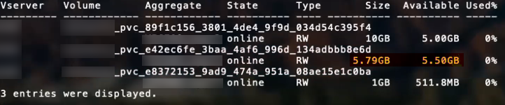

= 設定オプションと例
:hardbreaks:
:allow-uri-read: 
:icons: font
:imagesdir: ../media/

ONTAP SAN ドライバを作成して Astra Trident インストールで使用する方法をご確認ください。このセクションでは、バックエンド構成の例と、バックエンドをストレージクラスにマッピングする方法を詳しく説明します。

== バックエンド構成オプション

バックエンド設定オプションについては、次の表を参照してください。

[cols="3"]
|===
| パラメータ | 説明 | デフォルト 

| 「バージョン」 |  | 常に 1 

| 'torageDriverName' | ストレージドライバの名前 | 「 ONTAP-NAS 」、「 ONTAP-NAS-エコノミー 」、「 ONTAP-NAS-flexgroup 」、「 ONTAP-SAN 」、「 ONTAP-SAN-エコノミー 」 

| backendName` | カスタム名またはストレージバックエンド | ドライバ名 + "_" + データ LIF 

| 「管理 LIF 」 | クラスタ管理 LIF または SVM 管理 LIF の IP アドレス | 「 10.0.0.1 」、「 [2001:1234:abcd::fefe] 」 

| 「重複排除 | プロトコル LIF の IP アドレス。IPv6 には角かっこを使用します。設定後に更新することはできません | 特に指定がないかぎり、 SVM が派生します 

| 「 useCHAP 」 | CHAP を使用して ONTAP SAN ドライバ用の iSCSI を認証する [ ブーリアン ] | いいえ 

| 「 chapInitiatorSecret 」 | CHAP イニシエータシークレット。「 useCHAP = TRUE 」の場合は必須 | 「」 

| 「ラベル」 | ボリュームに適用する任意の JSON 形式のラベルのセット | 「」 

| 「 chapTargetInitiatorSecret 」 | CHAP ターゲットイニシエータシークレット。「 useCHAP = TRUE 」の場合は必須 | 「」 

| 「 chapUsername 」 | インバウンドユーザ名。「 useCHAP = TRUE 」の場合は必須 | 「」 

| 「 chapTargetUsername 」 | ターゲットユーザ名。「 useCHAP = TRUE 」の場合は必須 | 「」 

| 「 clientCertificate 」をクリックします | クライアント証明書の Base64 エンコード値。証明書ベースの認証に使用されます | 「」 

| 「 clientPrivateKey 」 | クライアント秘密鍵の Base64 エンコード値。証明書ベースの認証に使用されます | 「」 

| 「 trustedCacertifate 」 | 信頼された CA 証明書の Base64 エンコード値。任意。証明書ベースの認証に使用されます | 「」 

| 「ユーザ名」 | クラスタ / SVM に接続するためのユーザ名。クレデンシャルベースの認証に使用されます | 「」 

| 「 password 」と入力します | クラスタ / SVM に接続するためのパスワード。クレデンシャルベースの認証に使用されます | 「」 

| 'VM' | 使用する Storage Virtual Machine | SVM 「管理 LIF 」が指定されている場合に生成されます 

| 「 igroupName 」と入力します | SAN ボリュームで使用する igroup の名前 | "trident-<backend-UUID> " 

| 'toragePrefix' | SVM で新しいボリュームをプロビジョニングする際に使用するプレフィックスを指定します。設定後に更新することはできません | Trident 

| 「 AggreglimitateUsage 」と入力します | 使用率がこの割合を超えている場合は、プロビジョニングが失敗します。* Amazon FSX for ONTAP * には適用されません | “”（デフォルトでは適用されません） 

| 「 limitVolumeSize 」と入力します | 要求されたボリュームサイズがエコノミードライバーのこの値を超えている場合、プロビジョニングは失敗します。 | “”（デフォルトでは適用されません） 

| 'lunsPerFlexvol | FlexVol あたりの最大 LUN 数。有効な範囲は 50 、 200 です | 100 

| 「バグトレースフラグ」 | トラブルシューティング時に使用するデバッグフラグ。例： {"API" ： false 、 "method" ： true} | null 

| 「 useREST` 」 | ONTAP REST API を使用するためのブーリアンパラメータ。* テクニカルプレビュー * | いいえ 
|===

NOTE: 「 useREST 」は **tech preview** として提供されています。これはテスト環境では推奨され、本番ワークロードでは推奨されません。「 true 」に設定すると、 Astra Trident は ONTAP REST API を使用してバックエンドと通信します。この機能を使用するには、 ONTAP 9.9 以降が必要です。また ' 使用する ONTAP ログイン・ロールには ONTAP アプリケーションへのアクセス権が必要ですこれは ' 事前に定義された vsadmin ロールと cluster-admin ロールによって満たされます

ONTAP クラスタと通信するには、認証パラメータを指定する必要があります。これは、セキュリティログインまたはインストールされている証明書のユーザ名 / パスワードです。

WARNING: NetApp ONTAP バックエンドに Amazon FSX を使用している場合は、「 limitAggregateUsage 」パラメータを指定しないでください。Amazon FSX for NetApp ONTAP が提供する「 fsxadmin 」と「 vsadmin 」の役割には、集計の使用状況を取得したり、 Astra Trident を介して制限したりするために必要なアクセス権限が含まれていません。

WARNING: トラブルシューティングを行い、詳細なログダンプが必要な場合を除き、「 ebugTraceFlags 」は使用しないでください。

「 ONTAP -SAN 」ドライバの場合、デフォルトでは SVM のすべてのデータ LIF IP が使用され、 iSCSI マルチパスが使用されます。「 ONTAP -SAN 」ドライバのデータ LIF の IP アドレスを指定すると、マルチパスが無効になり、指定したアドレスだけが使用されます。

NOTE: バックエンドを作成するときは、作成後に「 datalif 」と「 toragePrefix 」を変更できないことに注意してください。これらのパラメータを更新するには、新しいバックエンドを作成する必要があります。

igroupName は、 ONTAP クラスタ上ですでに作成されている igroup に設定できます。指定しない場合、 Trident は trident-<backend-UUID> という名前の igroup を自動的に作成します。事前に定義された igroupName を指定する場合は、各 Kubernetes クラスタで igroup を使用することを推奨します。ただし、 SVM が環境間で共有される場合です。これは、 Astra Trident が IQN の追加や削除を自動的に維持するために必要です。

バックエンドは、作成後に igroup を更新することもできます。

* igroupName は、 Astra Trident の外部の SVM で作成および管理される新しい igroup を指すように更新できます。
* igroupName は省略できます。この場合、 Astra Trident は Trident によって trident-<backend-UUID> igroup が自動的に作成および管理されます。

どちらの場合も、ボリュームの添付ファイルには引き続きアクセスできます。以降のボリューム接続では、更新された igroup が使用されます。この更新によって、バックエンドにあるボリュームへのアクセスが中断されることはありません。

「管理 LIF 」オプションには完全修飾ドメイン名（ FQDN ）を指定できます。

すべての ONTAP ドライバ用の「管理 LIF 」を IPv6 アドレスに設定することもできます。--use-ipv6' フラグを付けて Trident をインストールしてください角かっこで囲まれた「管理 LIF 」 IPv6 アドレスを定義するように注意する必要があります。

WARNING: IPv6 アドレスを使用する場合は、 [28e8:d9fb:a825:b7bf:69a8:d02f:9e7b:3555] のように、バックエンド定義に含まれている場合は「 anagementlif` 」と「 datalif 」が角かっこ内に定義されていることを確認してください。「 data lif 」を指定しない場合、 Astra Trident は SVM から IPv6 データ LIF を取得します。

SAN ドライバで CHAP を使用できるようにするには ' バックエンド定義で useCHAP パラメータを true に設定しますその後、 Astra Trident が、バックエンドで指定された SVM のデフォルト認証として双方向 CHAP を設定して使用します。を参照してください link:ontap-san-prep.html["こちらをご覧ください"^] その仕組みについては、を参照してください。

「 ONTAP-SAN-エコノミー 」ドライバの場合は、「 limitVolumeSize 」オプションによって、 qtree および LUN 用に管理するボリュームの最大サイズも制限されます。

NOTE: Astra Trident は 'ONTAP-SAN' ドライバを使用して作成されたすべてのボリュームの Comments フィールドにプロビジョニングラベルを設定します作成された各ボリュームについて、 FlexVol の [Comments] フィールドに、配置先のストレージプールにあるすべてのラベルが入力されます。ストレージ管理者は、ストレージプールごとにラベルを定義し、ストレージプール内に作成されたすべてのボリュームをグループ化できます。これにより、バックエンド構成で提供されるカスタマイズ可能な一連のラベルに基づいてボリュームを簡単に区別できます。

=== ボリュームのプロビジョニング用のバックエンド構成オプション

これらのオプションを使用して、構成の特別なセクションで各ボリュームをデフォルトでプロビジョニングする方法を制御できます。例については、以下の設定例を参照してください。

[cols="3"]
|===
| パラメータ | 説明 | デフォルト 

| 「平和の配分」 | space-allocation for LUN のコマンドを指定します | 正しいです 

| 「平和のための準備」を参照してください | スペースリザベーションモード：「 none 」（シン）または「 volume 」（シック） | なし 

| 「ナプショットポリシー」 | 使用する Snapshot ポリシー | なし 

| 「 QOSPolicy 」 | 作成したボリュームに割り当てる QoS ポリシーグループ。ストレージプール / バックエンドごとに QOSPolicy または adaptiveQosPolicy のいずれかを選択します | 「」 

| 「 adaptiveQosPolicy 」を参照してください | アダプティブ QoS ポリシーグループ：作成したボリュームに割り当てます。ストレージプール / バックエンドごとに QOSPolicy または adaptiveQosPolicy のいずれかを選択します | 「」 

| 「スナップショット予約」 | スナップショット "0" 用に予約されたボリュームの割合 | 「 napshotPolicy 」が「 none 」の場合、それ以外の場合は「」 

| 'plitOnClone | 作成時にクローンを親からスプリットします | いいえ 

| 'plitOnClone | 作成時にクローンを親からスプリットします | いいえ 

| 「暗号化」 | ネットアップのボリューム暗号化を有効にします | いいえ 

| 'ecurityStyle' | 新しいボリュームのセキュリティ形式 | 「 UNIX 」 

| 階層ポリシー | 「なし」を使用する階層化ポリシー | ONTAP 9.5 よりも前の SVM-DR 構成の「スナップショットのみ」 
|===

NOTE: Trident が Astra で QoS ポリシーグループを使用するには、 ONTAP 9.8 以降が必要です。共有されない QoS ポリシーグループを使用して、各コンスティチュエントに個別にポリシーグループを適用することを推奨します。共有 QoS ポリシーグループにより、すべてのワークロードの合計スループットに対して上限が適用されます。

次に、デフォルトが定義されている例を示します。

[listing]
----
{
 "version": 1,
 "storageDriverName": "ontap-san",
 "managementLIF": "10.0.0.1",
 "dataLIF": "10.0.0.2",
 "svm": "trident_svm",
 "username": "admin",
 "password": "password",
 "labels": {"k8scluster": "dev2", "backend": "dev2-sanbackend"},
 "storagePrefix": "alternate-trident",
 "igroupName": "custom",
 "debugTraceFlags": {"api":false, "method":true},
 "defaults": {
     "spaceReserve": "volume",
     "qosPolicy": "standard",
     "spaceAllocation": "false",
     "snapshotPolicy": "default",
     "snapshotReserve": "10"
 }
}
----

NOTE: 「 'SAN 」ドライバを使用して作成されたすべてのボリュームに対して 'Astra Trident は 'LUN のメタデータに対応するために FlexVol にさらに 10% の容量を追加しますLUN は、ユーザが PVC で要求したサイズとまったく同じサイズでプロビジョニングされます。Astra Trident が FlexVol に 10% を追加（ ONTAP で利用可能なサイズとして表示）ユーザには、要求した使用可能容量が割り当てられます。また、利用可能なスペースがフルに活用されていないかぎり、 LUN が読み取り専用になることもありません。これは、 ONTAP と SAN の経済性には該当しません。

「スナップショット予約」を定義するバックエンドの場合、 Astra Trident は次のようにボリュームのサイズを計算します。

[listing]
----
Total volume size = [(PVC requested size) / (1 - (snapshotReserve percentage) / 100)] * 1.1
----
1.1 は、 Astra Trident の 10% の追加料金で、 FlexVol のメタデータに対応します。「 napshotReserve 」 =5% 、 PVC 要求 =5GiB の場合、ボリュームの合計サイズは 5.79GiB 、使用可能なサイズは 5.5GiB です。volume show コマンドは ' 次の例のような結果を表示する必要があります

現在、既存のボリュームに対して新しい計算を行うには、サイズ変更だけを使用します。

== 最小限の設定例

次の例は、ほとんどのパラメータをデフォルトのままにする基本的な設定を示しています。これは、バックエンドを定義する最も簡単な方法です。

NOTE: ネットアップ ONTAP で Astra Trident を使用している場合、 IP アドレスではなく LIF に DNS 名を指定することを推奨します。

=== 証明書ベースの認証を使用する ONTAP -SAN ドライバ

これは、バックエンドの最小限の設定例です。「 clientCertificate` 」、「 clientPrivateKey 」、「 trustedCACertifate` （信頼された CA を使用する場合はオプション）」は「 backend.json 」に格納され、それぞれクライアント証明書、秘密鍵、信頼された CA 証明書の Base64 でエンコードされた値を取得します。

[listing]
----
{
    "version": 1,
    "storageDriverName": "ontap-san",
    "backendName": "DefaultSANBackend",
    "managementLIF": "10.0.0.1",
    "dataLIF": "10.0.0.3",
    "svm": "svm_iscsi",
    "useCHAP": true,
    "chapInitiatorSecret": "cl9qxIm36DKyawxy",
    "chapTargetInitiatorSecret": "rqxigXgkesIpwxyz",
    "chapTargetUsername": "iJF4heBRT0TCwxyz",
    "chapUsername": "uh2aNCLSd6cNwxyz",
    "igroupName": "trident",
    "clientCertificate": "ZXR0ZXJwYXB...ICMgJ3BhcGVyc2",
    "clientPrivateKey": "vciwKIyAgZG...0cnksIGRlc2NyaX",
    "trustedCACertificate": "zcyBbaG...b3Igb3duIGNsYXNz"
}
----

=== 双方向 CHAP を使用する ONTAP と SAN のドライバ

これは、バックエンドの最小限の設定例です。この基本的な構成では 'useCHAP' を true' に設定して 'ONTAP-SAN' バックエンドを作成します

[listing]
----
{
    "version": 1,
    "storageDriverName": "ontap-san",
    "managementLIF": "10.0.0.1",
    "dataLIF": "10.0.0.3",
    "svm": "svm_iscsi",
    "labels": {"k8scluster": "test-cluster-1", "backend": "testcluster1-sanbackend"},
    "useCHAP": true,
    "chapInitiatorSecret": "cl9qxIm36DKyawxy",
    "chapTargetInitiatorSecret": "rqxigXgkesIpwxyz",
    "chapTargetUsername": "iJF4heBRT0TCwxyz",
    "chapUsername": "uh2aNCLSd6cNwxyz",
    "igroupName": "trident",
    "username": "vsadmin",
    "password": "secret"
}
----

=== ONTAP - SAN エコノミードライバ

[listing]
----
{
    "version": 1,
    "storageDriverName": "ontap-san-economy",
    "managementLIF": "10.0.0.1",
    "svm": "svm_iscsi_eco",
    "useCHAP": true,
    "chapInitiatorSecret": "cl9qxIm36DKyawxy",
    "chapTargetInitiatorSecret": "rqxigXgkesIpwxyz",
    "chapTargetUsername": "iJF4heBRT0TCwxyz",
    "chapUsername": "uh2aNCLSd6cNwxyz",
    "igroupName": "trident",
    "username": "vsadmin",
    "password": "secret"
}
----

== 仮想ストレージプールを使用するバックエンドの例

以下に示すバックエンド定義ファイルの例では ' すべてのストレージ・プールに対して特定のデフォルトが設定されていますたとえば 'paceReserve at none'`paceAllocation] at false' と 'encryption' は false です仮想ストレージプールは、ストレージセクションで定義します。

この例では ' 一部のストレージ・プールで独自の 'aceReserve'`paceAllocation] ' および [encryption`] 値が設定されていますまた ' 一部のプールでは ' 上で設定したデフォルト値が上書きされます

[listing]
----
{
    "version": 1,
    "storageDriverName": "ontap-san",
    "managementLIF": "10.0.0.1",
    "dataLIF": "10.0.0.3",
    "svm": "svm_iscsi",
    "useCHAP": true,
    "chapInitiatorSecret": "cl9qxIm36DKyawxy",
    "chapTargetInitiatorSecret": "rqxigXgkesIpwxyz",
    "chapTargetUsername": "iJF4heBRT0TCwxyz",
    "chapUsername": "uh2aNCLSd6cNwxyz",
    "igroupName": "trident",
    "username": "vsadmin",
    "password": "secret",

    "defaults": {
          "spaceAllocation": "false",
          "encryption": "false",
          "qosPolicy": "standard"
    },
    "labels":{"store": "san_store", "kubernetes-cluster": "prod-cluster-1"},
    "region": "us_east_1",
    "storage": [
        {
            "labels":{"protection":"gold", "creditpoints":"40000"},
            "zone":"us_east_1a",
            "defaults": {
                "spaceAllocation": "true",
                "encryption": "true",
                "adaptiveQosPolicy": "adaptive-extreme"
            }
        },
        {
            "labels":{"protection":"silver", "creditpoints":"20000"},
            "zone":"us_east_1b",
            "defaults": {
                "spaceAllocation": "false",
                "encryption": "true",
                "qosPolicy": "premium"
            }
        },
        {
            "labels":{"protection":"bronze", "creditpoints":"5000"},
            "zone":"us_east_1c",
            "defaults": {
                "spaceAllocation": "true",
                "encryption": "false"
            }
        }
    ]
}
----
次に 'ONTAP-SAN-エコノミー ・ドライバの iSCSI の例を示します

[listing]
----
{
    "version": 1,
    "storageDriverName": "ontap-san-economy",
    "managementLIF": "10.0.0.1",
    "svm": "svm_iscsi_eco",
    "useCHAP": true,
    "chapInitiatorSecret": "cl9qxIm36DKyawxy",
    "chapTargetInitiatorSecret": "rqxigXgkesIpwxyz",
    "chapTargetUsername": "iJF4heBRT0TCwxyz",
    "chapUsername": "uh2aNCLSd6cNwxyz",
    "igroupName": "trident",
    "username": "vsadmin",
    "password": "secret",

    "defaults": {
          "spaceAllocation": "false",
          "encryption": "false"
    },
    "labels":{"store":"san_economy_store"},
    "region": "us_east_1",
    "storage": [
        {
            "labels":{"app":"oracledb", "cost":"30"},
            "zone":"us_east_1a",
            "defaults": {
                "spaceAllocation": "true",
                "encryption": "true"
            }
        },
        {
            "labels":{"app":"postgresdb", "cost":"20"},
            "zone":"us_east_1b",
            "defaults": {
                "spaceAllocation": "false",
                "encryption": "true"
            }
        },
        {
            "labels":{"app":"mysqldb", "cost":"10"},
            "zone":"us_east_1c",
            "defaults": {
                "spaceAllocation": "true",
                "encryption": "false"
            }
        }
    ]
}
----

== バックエンドを StorageClasses にマッピングします

次の StorageClass 定義は、上記の仮想ストレージプールを参照してください。parameters.selector` フィールドを使用すると ' 各 StorageClass は ' ボリュームのホストに使用できる仮想プールを呼び出しますボリュームには、選択した仮想プール内で定義された要素があります。

* 最初の StorageClass （「 protection-gold 」）は、「 ontap/na-slexgroup 」バックエンドの最初の 2 番目の仮想ストレージプールと「 ontap/san' バックエンドの最初の仮想ストレージプールにマッピングされます。ゴールドレベルの保護を提供している唯一のプールです。
* 2 番目の StorageClass （「 protection-not-gold 」）は、「 ONTAP-NAS-flexgroup 」バックエンドの第 3 の仮想ストレージプールと「 ONTAP-SAN' バックエンドの第 2 の第 3 の仮想ストレージプールにマッピングされます。金色以外の保護レベルを提供する唯一のプールです。
* 3 番目の StorageClass （「 app-mysqldb 」）は、「 ONTAP-NAS' バックエンドの 4 番目の仮想ストレージプールと「 ONTAP-SAN-エコノミー 」バックエンドの 3 番目の仮想ストレージプールにマッピングされます。mysqldb タイプのアプリケーション用のストレージプール設定を提供しているプールは、これらだけです。
* 4 番目の StorageClass （「 protection-silver - creditpoints-20K 」）は、「 ONTAP-NAS-flexgroup 」バックエンドの 3 番目の仮想ストレージプールと「 ONTAP-SAN' バックエンドの 2 番目の仮想ストレージプールにマッピングされます。ゴールドレベルの保護を提供している唯一のプールは、 20000 の利用可能なクレジットポイントです。
* 5 番目の StorageClass （「 creditpoints-5k 」）は、「 ONTAP-NAS-エコノミー 」バックエンドの 2 番目の仮想ストレージプール、「 ONTAP-SAN」 バックエンドの 3 番目の仮想ストレージプールにマッピングされます。5000 ポイントの利用可能な唯一のプールは以下のとおりです。

Trident が、どの仮想ストレージプールを選択するかを判断し、ストレージ要件を確実に満たすようにします。

[listing]
----
apiVersion: storage.k8s.io/v1
kind: StorageClass
metadata:
  name: protection-gold
provisioner: netapp.io/trident
parameters:
  selector: "protection=gold"
  fsType: "ext4"
---
apiVersion: storage.k8s.io/v1
kind: StorageClass
metadata:
  name: protection-not-gold
provisioner: netapp.io/trident
parameters:
  selector: "protection!=gold"
  fsType: "ext4"
---
apiVersion: storage.k8s.io/v1
kind: StorageClass
metadata:
  name: app-mysqldb
provisioner: netapp.io/trident
parameters:
  selector: "app=mysqldb"
  fsType: "ext4"
---
apiVersion: storage.k8s.io/v1
kind: StorageClass
metadata:
  name: protection-silver-creditpoints-20k
provisioner: netapp.io/trident
parameters:
  selector: "protection=silver; creditpoints=20000"
  fsType: "ext4"
---
apiVersion: storage.k8s.io/v1
kind: StorageClass
metadata:
  name: creditpoints-5k
provisioner: netapp.io/trident
parameters:
  selector: "creditpoints=5000"
  fsType: "ext4"
----