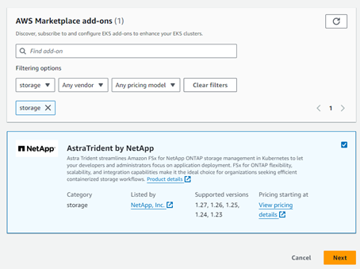
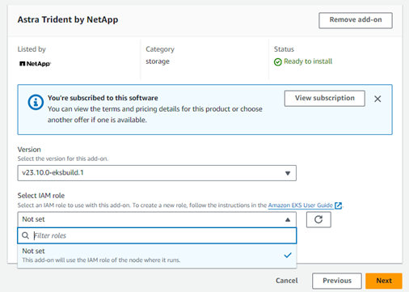
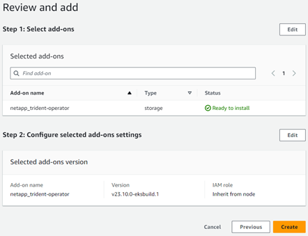
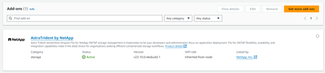

= EKSクラスタでのAstra Trident EKSアドオンバージョン23.10の設定
:hardbreaks:
:allow-uri-read: 
:icons: font
:imagesdir: ../media/

[role="lead"]
Astra Tridentは、KubernetesでのAmazon FSx for NetApp ONTAPストレージ管理を合理化し、開発者や管理者がアプリケーションの導入に集中できるようにします。Astra Trident EKSアドオンには、最新のセキュリティパッチ、バグ修正が含まれており、AWSによってAmazon EKSとの連携が検証されています。EKSアドオンを使用すると、Amazon EKSクラスタの安全性と安定性を一貫して確保し、アドオンのインストール、構成、更新に必要な作業量を削減できます。

== 前提条件

AWS EKS用のAstra Tridentアドオンを設定する前に、次の条件を満たしていることを確認してください。

* アドオンサブスクリプションがあるAmazon EKSクラスタアカウント
* AWS MarketplaceへのAWS権限：
`"aws-marketplace:ViewSubscriptions",
"aws-marketplace:Subscribe",
"aws-marketplace:Unsubscribe`
* AMIタイプ：Amazon Linux 2（AL2_x86_64）またはAmazon Linux 2 Arm（AL2_ARM_64）
* ノードタイプ：AMDまたはARM
* 既存のAmazon FSx for NetApp ONTAPファイルシステム

== 手順

. EKS Kubernetesクラスタで、*アドオン*タブに移動します。
+
image::../media/aws-eks-01.png[AWS EKS 01]

. [AWS Marketplace add-ons]*にアクセスし、_storage_categoryを選択します。
+

. [AstraTrident by NetApp *]を探し、Astra Tridentアドオンのチェックボックスを選択します。
. 必要なアドオンのバージョンを選択します。
+

. ノードから継承するIAMロールオプションを選択します。
. 必要に応じてオプションの設定を行い、* Next *を選択します。
+

. 「 * Create * 」を選択します。
. アドオンのステータスが_Active_であることを確認します。
+

== CLIを使用したAstra Trident EKSアドオンのインストールとアンインストール

.CLIを使用してAstra Trident EKSアドオンをインストールします。
次のコマンド例は、Astra Trident EKSアドオンをインストールします。
`eksctl create addon --cluster K8s-arm --name netapp_trident-operator --version v23.10.0-eksbuild.`
`eksctl create addon --cluster K8s-arm --name netapp_trident-operator --version v23.10.0-eksbuild.1` （専用バージョンを使用）

.CLIを使用してAstra Trident EKSアドオンをアンインストールします。
次のコマンドは、Astra Trident EKSアドオンをアンインストールします。
`eksctl delete addon --cluster K8s-arm --name netapp_trident-operator`
